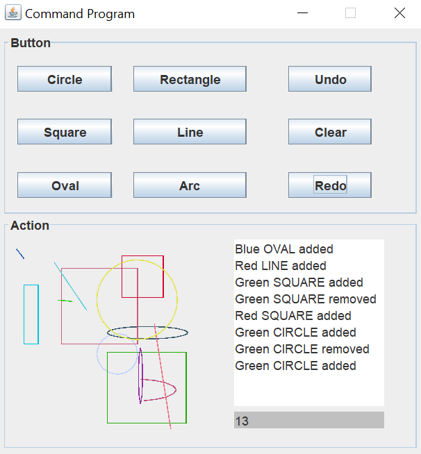
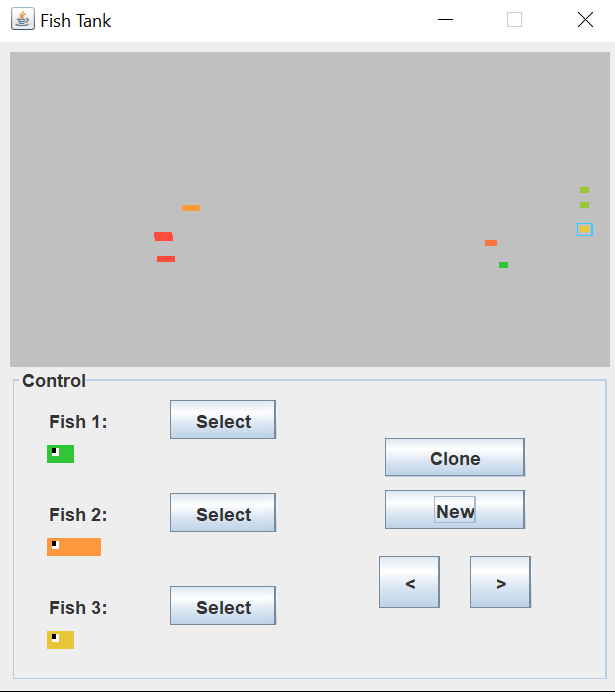
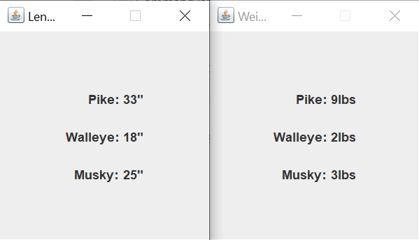
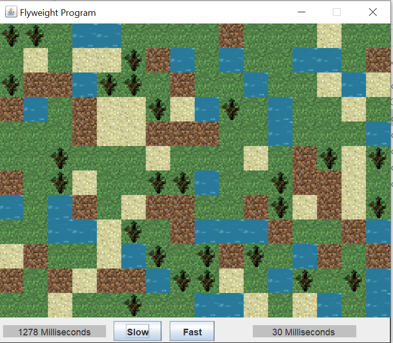
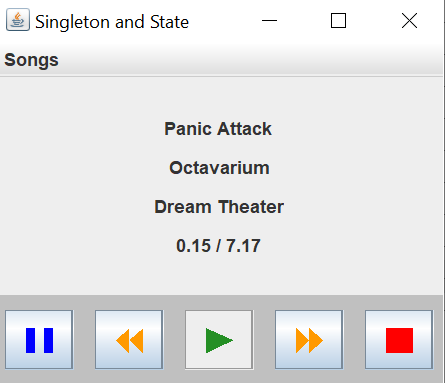
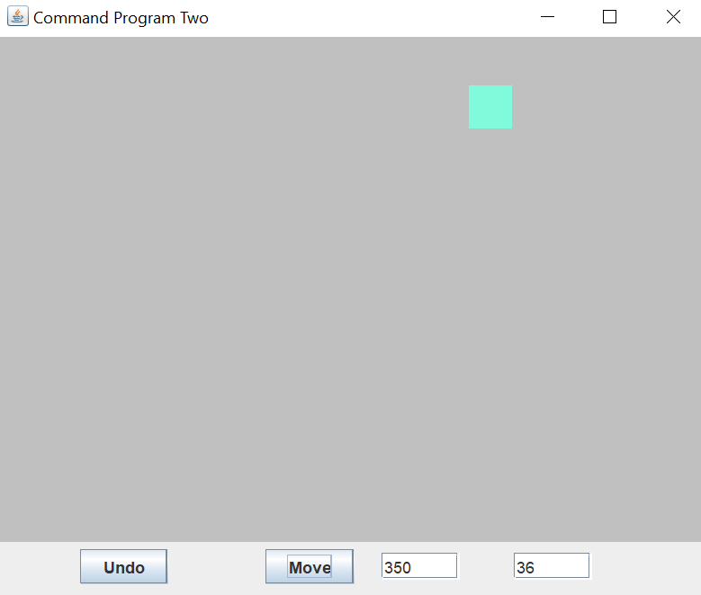

# Design-Patterns
A few small java programs created using the Command, Prototype, Observer, Flyweight, State, and Singleton desing patterns.
Also uses the java swing GUI library.

COMMAND: 
Paints random shapes to the screen using the command pattern. 
The shapes can be undone or redone aswell using this pattern. 

 
 
PROTOTYPE: 
Generates three random "fish" that move freely around in a fish tank. 
You can select one of these fish and clone them using the Prototype pattern. 
Cloning the fish will create another identical one. 

 
 
OBSERVER: 
I honestly don't remember how this one works at all. 
Nor do I remember what it even does. 

 
 
FLYWEIGHT: 
Generates "terrain" in two different ways depending on which button is clicked. 
The fast button generates it with the flyweight pattern. 
The slow button generates it the way I would have done it before using this pattern. 
The time it took to generate each is recorded and displayed beside the buttons. 

 
 
STATE & SINGLETON: 
A music player where you can select a song from the top menu. 
(Does not actually play any music, but merely counts down the length of the song.) 
You can pause, stop, fast forward, or rewind the song using the State Pattern. 
(I don't remember how the singleton pattern was used, but it is in there somewhere.) 

 
 
 
 
ANOTHER ONE USING COMMAND: 

 
